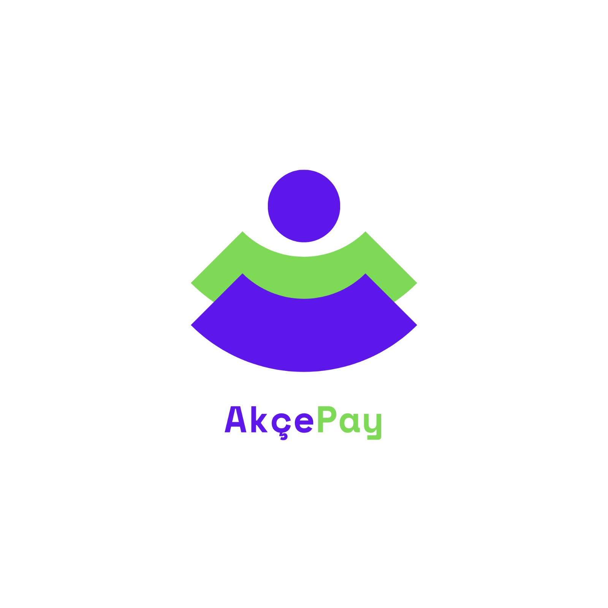

  
  <h1>🪙 AkçePay</h1>
  
<b>Finans ve Yatırım Dünyasına Risksiz Adım Atın! / Step into the World of Finance Risk-Free!</b>

  
  
  
  [English Version Below](#english-version)

---

## 🇹🇷 Türkçe | Proje Hakkında
AkçePay, kullanıcıların gerçek para kaybetme riski olmadan finansal okuryazarlıklarını geliştirebilecekleri kapsamlı bir simülasyon uygulamasıdır. Bir yazılım mühendisliği dersi projesi olarak geliştirilen AkçePay, popüler dijital cüzdanların sunduğu pratik arayüz deneyimini ve gerçek zamanlı borsa verilerini tek bir platformda birleştirir. Uygulama, modern "Bento Grid" yerleşimi ve karanlık tema (dark mode) odaklı, akıcı bir UI ile tasarlanmaktadır.

*⚠️ Önemli Not: AkçePay gerçek bir banka veya aracı kurum değildir. Uygulama içindeki tüm bakiyeler ve işlemler tamamen sanaldır.*

### ✨ Temel Özellikler
*   **💳 Sanal Cüzdan:** Bakiye yönetimi ve finansal takip.
*   **💸 Sanal Transferler:** Arkadaşlar arası riskiz para gönderme ve hesap bölüşme deneyimi.
*   **📈 Canlı Borsa Simülasyonu:** Gerçek piyasa verileriyle çalışan, sıfır riskli hisse senedi alım/satım işlemleri.

### 🛠️ Teknolojiler
*   **Frontend:** Flutter
*   **Backend & Veritabanı:** *Geliştirme aşamasında*

---

## 🇬🇧 English | About the Project
AkçePay is a comprehensive simulation app designed to help users improve their financial literacy without the fear of losing real money. Developed as a software engineering course project, AkçePay combines the practical UI experience of popular digital wallets with real-time stock market data. The application is built with a sleek, dark mode-focused design utilizing a modern "Bento Grid" layout.

*⚠️ Important Note: AkçePay is not a real bank or brokerage. All balances and transactions within the app are strictly virtual.*

### ✨ Core Features
*   **💳 Virtual Wallet:** Balance management and financial tracking.
*   **💸 Virtual Transfers:** Risk-free peer-to-peer money sending and bill splitting.
*   **📈 Live Stock Market Simulation:** Zero-risk stock trading powered by real market data.

### 🛠️ Technologies
*   **Frontend:** Flutter
*   **Backend & Database:** *Work in progress*

---
> *Development is ongoing... / Geliştirme süreci devam etmektedir...*
